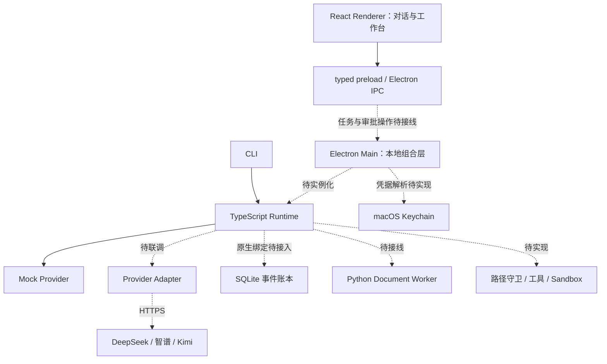

# 桌面端、CLI 与 Runtime 分工

记录日期：2026-09-30。本文落盘架构确认后的交互修正和前后端讨论，是 ADR-0001 的实现说明；当前接线状态以 [实现状态](../development/implementation-status.md) 为准。

## 前后端分离的含义

Helm 逻辑上前后端分离，部署上本地一体化，桌面通信优先使用 IPC。它与互联网 Web 应用同样区分展示和业务逻辑，但首版不需要部署远程业务服务器，也不需要为了 CLI 单独启动 HTTP 服务。

以下是目标关系，虚线表示尚未接通的主要边界：

| 层 | 负责 | 交互边界 |
|---|---|---|
| Renderer | 消息、输入、进度、Diff、审批展示 | 通过 preload 请求操作，不直接访问 Node、文件、密钥 |
| Preload / IPC | 暴露明确的方法与事件订阅 | 请求校验、来源检查、错误归一化需要随接线补齐 |
| Electron Main | 组装 Runtime、存储、凭据、执行适配器 | 持有运行实例，组织 IPC 和后台任务生命周期 |
| Runtime | 状态机、预算、Policy、执行回执、Verification | 模型提出 proposal，Runtime 决定执行与完成 |
| CLI | 命令、输出、后续显式运行控制 | 直接导入同一 Runtime package |
| Python worker | 单次文件处理与结构化回执 | 无 Agent 循环和审批权；受限运行环境待实现 |
| Provider | 厂商请求与响应适配 | 云 API 推理；不拥有本地执行权 |

## 对话优先的工作台

用户已明确中栏应为对话区。最终布局约定为：

- 左栏选择 Workspace 和 Session。
- 中栏保留用户/助手消息、当前执行卡片、底部输入框。详细步骤、工具输出和长日志按需展开，不能占满主对话区。
- 右栏展示当前 Run 对应的 Artifact、Diff、Approval 和 Verification。
- 终端和原始 Trace 可进入底部抽屉；这部分目前仍是规划。

当前 UI 已改为消息流与输入框布局，但消息、步骤和右栏结果来自本地演示数据。`sendMessage()` 只清空输入，`Continue run` 使用定时器改变步骤，审批 IPC 返回 pending 后界面自行显示 approved；均不能作为执行证据。

## 下一步的调用流程

1. Renderer 提交用户输入与已选择的工作区/会话标识。
2. Preload 调用限定 IPC；Main 校验请求并调用 Runtime 创建或推进任务。
3. Runtime 在事件写入成功后发布带 Run id 和序号的事件；Main 转发给对应窗口。
4. Renderer 根据事件和查询快照更新消息、执行卡片和验收状态；重连时去重、补齐遗漏事件。
5. 暂停/恢复/取消由 Runtime 处理。审批提交绑定的动作标识及决定，不能靠 UI 布尔值或模型文字放行。
6. Provider 流式输出、实际文件工具和持久恢复逐步接入；最初用 Mock 跑通相同控制路径。

这些步骤是下一切片的验收目标，目前尚未实现。

## 进程与部署边界

桌面 app 和 CLI 复用代码，不代表它们已经共享同一个运行进程或内存。当前 CLI 每次启动创建独立内存账本；跨进程查看/恢复同一个 Run，需要后续持久化、所有权和并发协议。

Node Runtime 首先以 package 形式嵌入。将来若长任务需要脱离窗口持续运行，可以移到本地独立进程；无需现在引入网络服务、账号或多租户部署。
